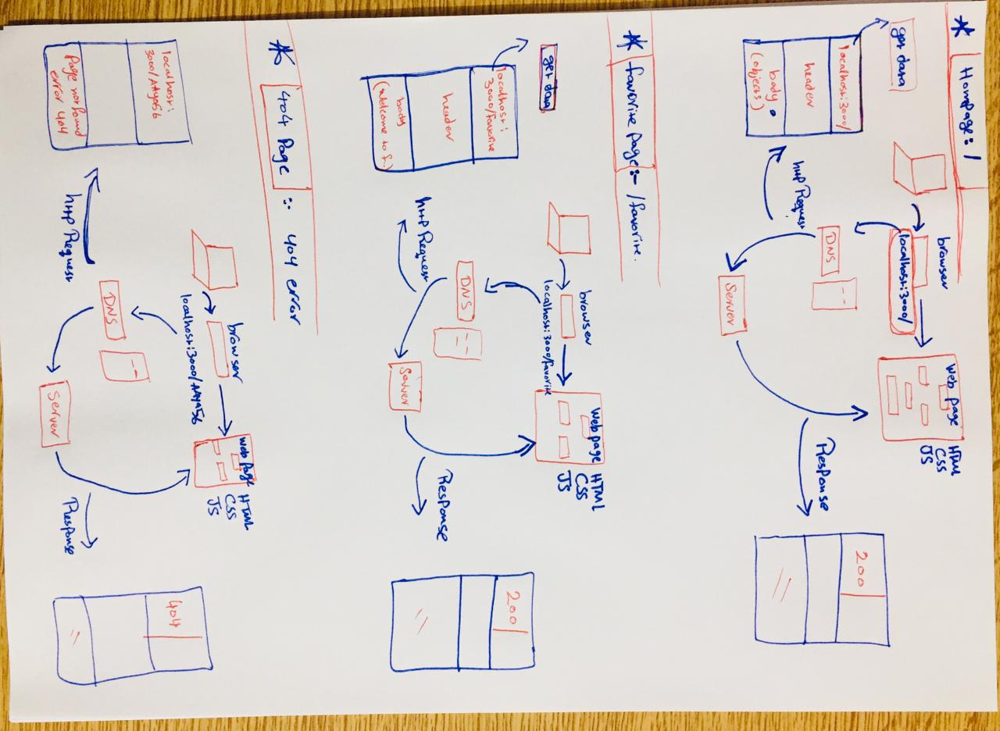

# Movies-Library - Version 1

**Author Name**: Ayah Hameedat

## WRRC
Add an image of your WRRC here

## Overview

## Getting Started
<!-- What are the steps that a user must take in order to build this app on their own machine and get it running? -->

- first clone The project in the terminal
- you have to do npm i to install the required packages
- write (npm start) command to run the server
- try this Link (localhost:3000/) to get HomePage
- try this link (localhost:3000/favorite) to get The Favorite page.
- once you finished you can press on ctrl+c to stop the work in the server.

## Project Features
<!-- What are the features included in you app -->

- When you write (localhost:3000/) on browser search will get the Homepage of Movies Website.
- When you write (localhost:3000/favorite) on browser search will get the favorite page of Movies Website.
- when you write the link with mistakes latter ,will get The 404 error.

**Comment**
### I can't test The error 500