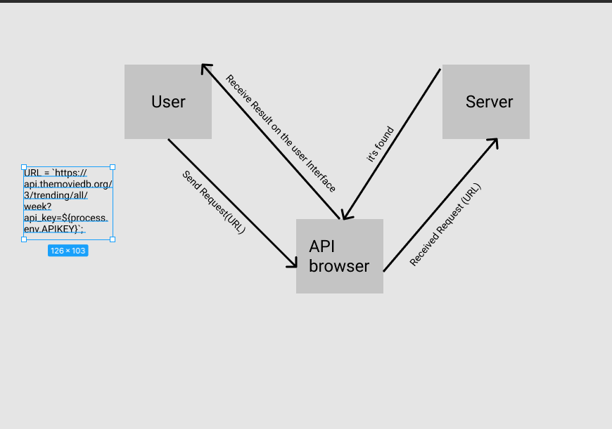

# Movies-Library - Version 4

**Author Name**: Ayah Hameedat

## WRRC

## Overview
### Movies Website will build using JS and API 
## Getting Started
<!-- What are the steps that a user must take in order to build this app on their own machine and get it running? -->

- First clone The project in the terminal
- you have to do npm i to install the required packages
- Install the required packages for this task: npm install axios dotenv and npm install pg
- write (npm start) command to run the server
- try this Link (localhost:3000/trending) to get The trending movies page.
- try this link (localhost:3000/search) to get The search page to watch the favorite movies you want.
- try this Link (localhost:3000/addMovie) to add The movies you want.
- try this Link (localhost:3000/getMovies) to get The movies you added.
- try this Link (localhost:3000/UPDATE/:id) to update The movies you want by determining the id.
- try this Link (localhost:3000/DELETE/:id) to delete The movies you want by determining the id.
- try this Link (localhost:3000/getMovie/:id) to get The movie you want by determining the id.
- once you finished you can press on ctrl+c to stop the work on the server.

## you have to create your own DB and use some commands to work. 

## Project Features
<!-- What are the features included in you app -->

- When you write (localhost:3000/trending) on browser search will get the trending page of the Movies Website.
- When you write (localhost:3000/search) on browser search will get the search page to watch favorite movies you want.
- when you write the link with mistakes later, will get The 404 error.
- you can create your own movies you want by using (localhost:3000/addMovie).
- you can edit the movies that you added by using (localhost:3000/UPDATE/:id).
- you can get a specific movie by determining its ID by using (localhost:3000/getMovie/:id).
- you can delete movies that you don't want by determining their ID by using (localhost:3000/DELETE/:id).